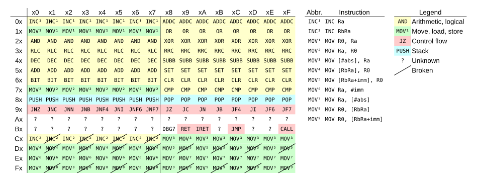

Binary Ninja Avnera plugin
==========================

The Avnera plugin provides an Avnera AV6xxx/AV7xxx architecture for Binary Ninja. Even the existence of this architecture is not made public by Avnera; the function of the opcodes is determined via black box reverse engineering, and the mnemonics are all made up by Catherine "whitequark".

Dedicated with 🧡 to [Frederick G. Weiss and his colleagues at Avnera Corporation](https://fccid.io/V3CAVMD7F11A/Letter/Confidential-Letter-1082866.pdf).

## Features

* All of the instructions described in [this document](https://github.com/Prehistoricman/AV7300/blob/master/Instruction%20set%20notes.txt) are implemented, and their function (especially the use of flags) has been extensively manually verified by examining control and data flow in the available blobs.
* All of the instructions are lifted to LLIL.
* `MOV` instructions are fused during disassembly to `MOVW` and `MOVP` instructions when they are used in pairs implementing 16-bit operations to enable BN to discover more pointers during analysis.
* `ADD R0, R0; RLC Rn` instructions are fused during disassembly to `LSL RnR0` instructions.
* Opcode `B8` is not implemented as its function is not precisely known. It is likely some kind of trap, possibly debug trap.
* Opcodes `A0` to `AF`, `B0` to `B7`, `BB`, `BD`, and `BE` are not implemented as their function is not known.
* Opcodes `C1`, `C3`, `C5`, `C7`, `D1`, `D3`, `D5`, `D7`, `D9`, `DB`, `DD`, `DF`, `F1`, `F3`, `F5`, `F7`, `F9`, `FB`, `FD`, `FF` have known functionality but their decoding is disabled as they aren't present in the available blobs and appear to be invalid opcodes that unintentionally perform a function.

## Devices

This plugin supports at least the following devices:

* AV7300
* AV7320
* AV6202

If you've successfully used the plugin with another device, please add it to the list and send a pull request!

## Cheatsheet

## Acknowledgements

This plugin is heavily based on the excellent [AV7300 research](https://github.com/Prehistoricman/AV7300) by [@Prehistoricman](https://github.com/Prehistoricman).

## License

[0-clause BSD](LICENSE-0BSD.txt)
